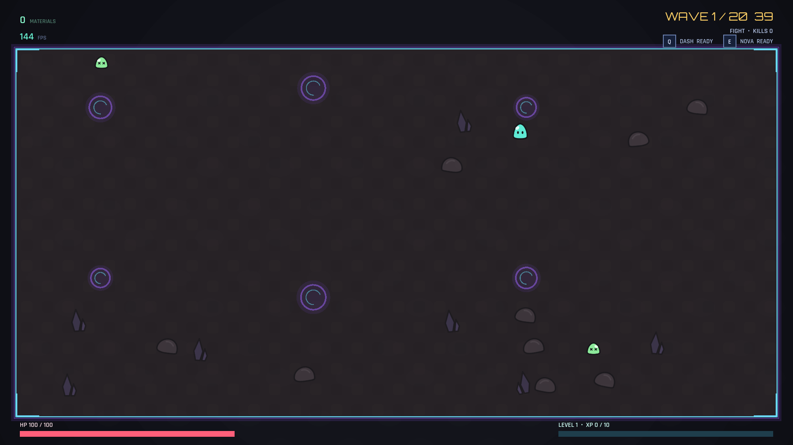
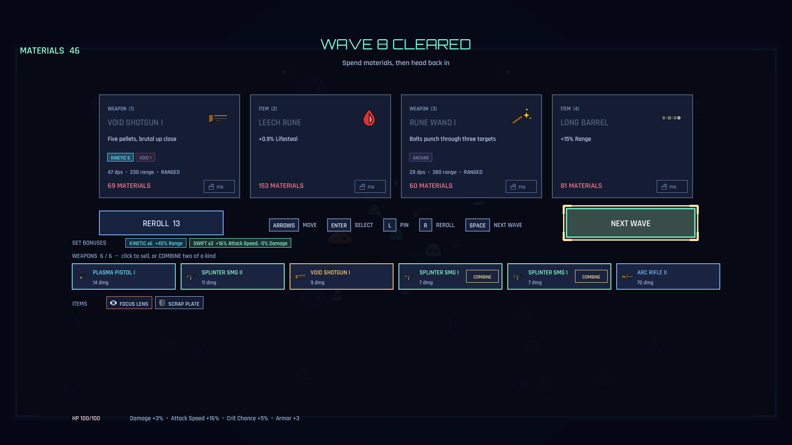
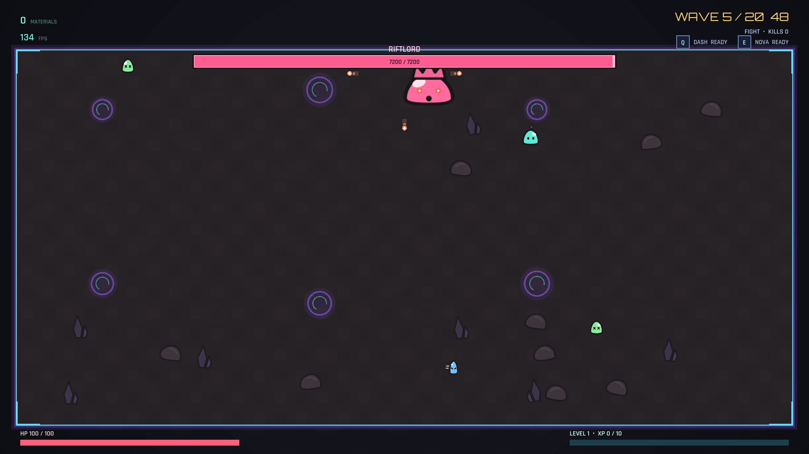
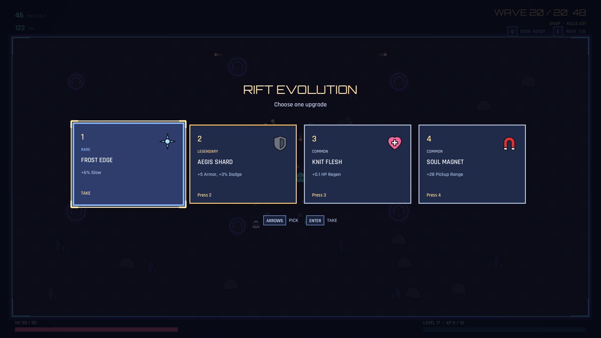
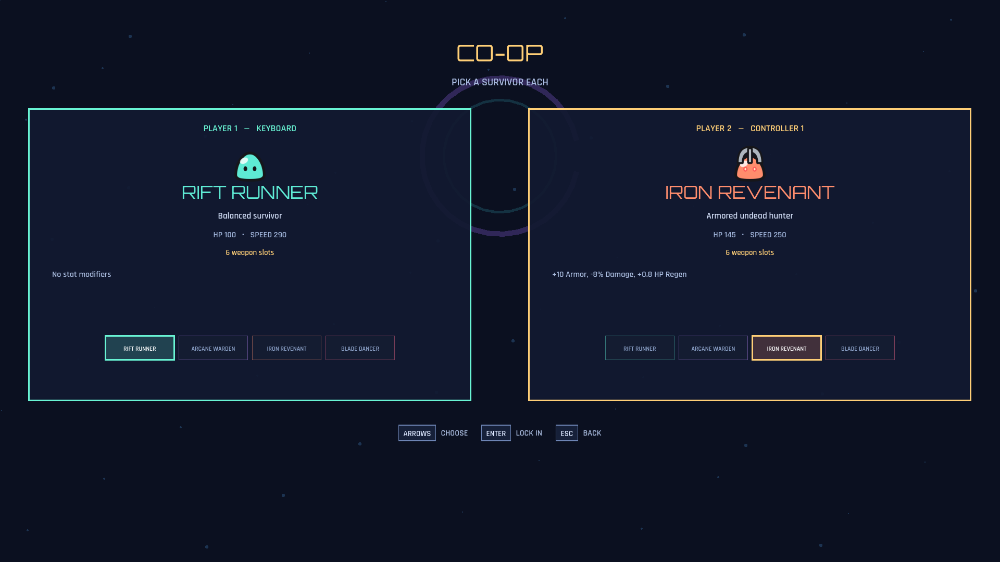
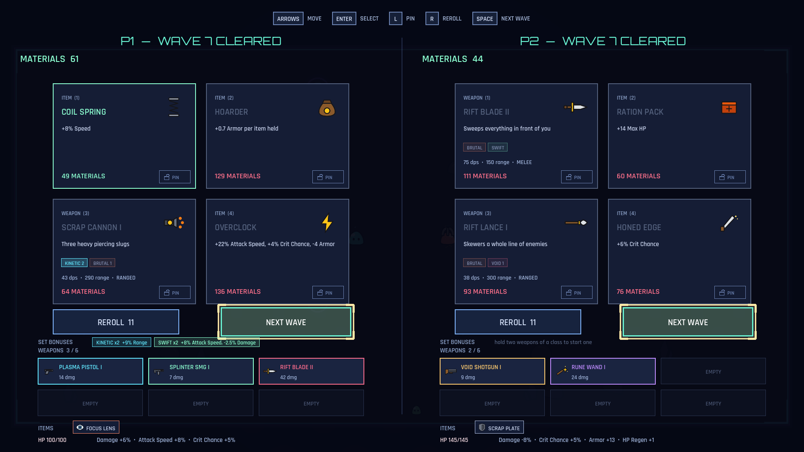
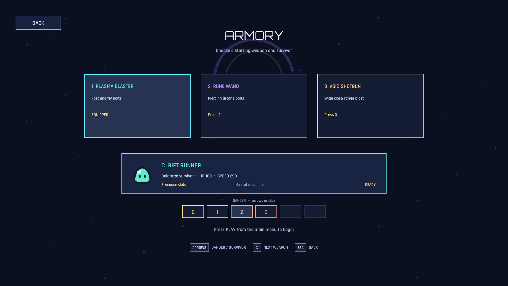
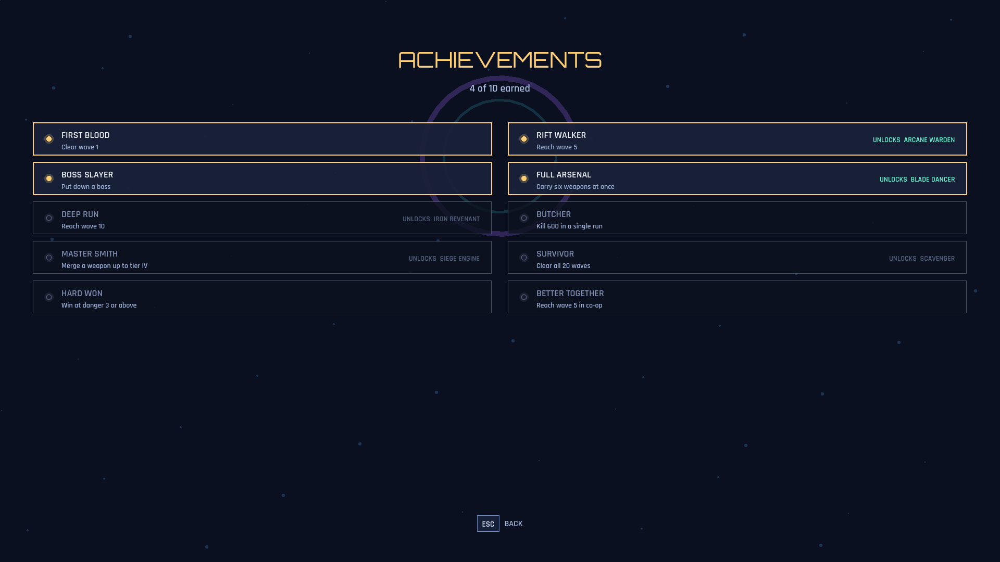
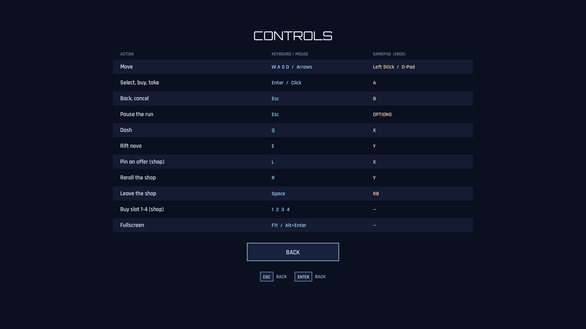
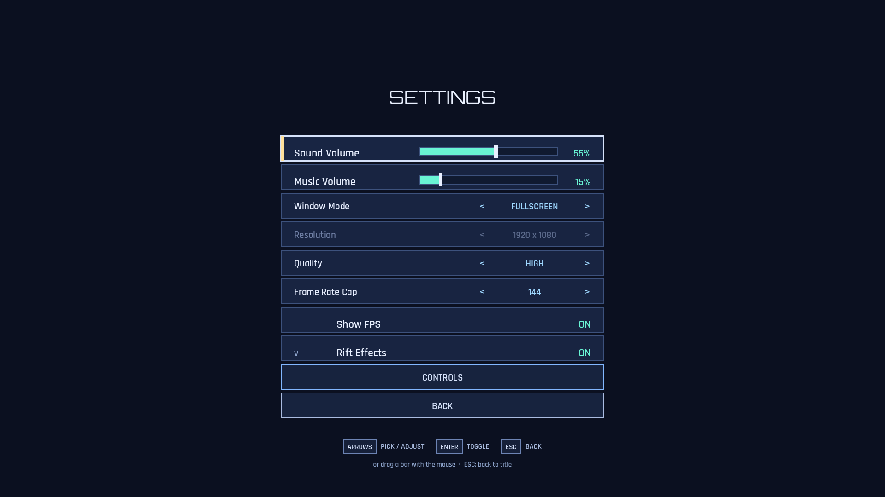

# Riftbound Survivors

A wave-survival arena game built in **Godot 4**. You only move — your weapons
fire themselves. Everything else is decided in the shop between waves.



---

## The loop

A run is **20 waves**. Each wave is a timed fight; survive it and the shop
opens, which is where the run is actually built. Materials are both the shop
currency and your XP, so every pickup counts twice.

Clear wave 20 and you win, which unlocks the next of **6 danger levels** —
tougher enemies, richer drops.

| | |
| --- | --- |
| **Weapons** | 11, in 4 archetypes and 5 classes, 4 tiers each |
| **Items** | 25 — 19 flat stat items, 6 that scale off the rest of your build |
| **Survivors** | 6, several restricting what weapons you can hold |
| **Enemies** | 9 types + 2 bosses, unlocking one wave at a time |
| **Level-up rewards** | 18, four offered at a time |
| **Achievements** | 10, five of which unlock a survivor |

---

## The shop is the game



Four offers a wave. You can **pin** anything you cannot afford yet and it
survives every reroll *and* the wave after it, so saving up is a real plan.

Two of the same weapon at the same tier can be **combined** into one a tier
higher — but only when you choose to. Two barrels firing now, or one weapon
that hits far harder, is a decision the game deliberately does not make for you.

Weapons belong to classes (KINETIC, ARCANE, BRUTAL, SWIFT, VOID). Holding
several of a class pays an escalating bonus, and most of those bonuses cost you
something else. The shop biases its rolls toward classes you already hold, so a
run converges into a build instead of handing you twenty unrelated guns.

---

## Bosses



Every fifth wave. They chase, and every few seconds they punctuate the chase
with a radial volley — alternating a four-spoke **plus** and an eight-spoke
**star**, with the star twisted half a step so it fires through the gaps the
plus left. Standing in one safe lane never works twice.

---

## Levelling



Four rewards offered, one taken. Pure stat grants, kept in their own ledger so
that buying an item later never erases them.

---

## Local co-op



Two players on one machine, on **any two devices** — two controllers, or a
controller and the keyboard. Hold to join; whoever holds it first is player one.

The arena is **shared**, so you both fight in one space. Only the screens that
ask you to choose something are split:



Each player gets their own shop board, their own materials and their own
level-up choices. Neither can drag the other out of a screen they are still
using — both have to press NEXT WAVE.

You only lose when **both** of you are down. If one survives the wave, the
other comes back for the next one.

---

## Survivors and progression



Survivors are **earned, not bought**. Each locked one sits behind an
achievement, so opening one asks you to do something you have not done yet
rather than to grind coins.



---

## Controls

Full **keyboard, mouse and controller** support everywhere, and the on-screen
prompts switch to whichever device is in your hands the moment you touch it.



| | Keyboard | Controller |
| --- | --- | --- |
| Move | WASD / Arrows | Left stick / D-pad |
| Select | Enter / Click | Cross (A) |
| Back | Esc | Circle (B) |
| Dash | Left Shift | Square (X) |
| Rift Nova | E | Triangle (Y) |
| Pin an offer | L | Square (X) |
| Reroll shop | R | Triangle (Y) |
| Next wave | Space | R1 |

---

## Settings



Window mode, resolution, quality preset, frame-rate cap and an FPS readout.
**Quality is a frame-cost dial rather than a prettiness one** — it caps the
things that multiply with the crowd (damage numbers, scatter, screen shake), so
dropping it actually helps a machine that is struggling.

---

## Playing it

**Download:** grab the latest release, unzip, run `RiftboundSurvivors.exe`.
Windows may show a SmartScreen warning because the build is not code-signed —
click *More info* → *Run anyway*.

**From source:**

```bash
git clone https://github.com/<you>/riftbound-survivors.git
cd riftbound-survivors
godot project.godot          # or open project.godot in the Godot editor
```

Built with **Godot 4.7**. No plugins, no external dependencies.

---

## For developers

```bash
# the integration suite — 397 assertions against the real game
godot --headless --path . --script res://tests/integration_test.gd

# capture a frame from every screen
godot --path . --script res://tests/screenshot.gd -- <output_dir>

# model all 20 waves with the real balance formulas
godot --headless --path . --script res://tests/balance_report.gd -- 0
```

`ARCHITECTURE.md` is the map of the code.

A few things worth knowing about how this project is built:

**Every image is generated by the repository.** All 17 actors, the props, the
floor tiles and all 32 weapon and item icons are drawn as SVG by two scripts in
`tests/` — `draw_actors.gd` and `draw_icons.gd`. Nothing is a sourced asset.
That makes the art free, consistent by construction (every character is the same
body function with different numbers), and resolution independent. Editing a
character means editing a number and re-running the script.

**The tests boot the real game.** `tests/integration_test.gd` loads the actual
`Main.tscn` and drives it — real input actions, real physics frames, real shop
transactions — rather than unit-testing around the edges. It ends by asserting
that the expected *number* of assertions actually ran, because a GDScript
runtime error aborts only the function it happens in and would otherwise leave
a broken test silently passing.

**Every balance number lives in one file.** `scripts/data/balance.gd` holds the
entire difficulty curve, and `tests/balance_report.gd` walks all twenty waves
using those same formulas to report whether the crowd outgrows your damage and
whether your purse outgrows the prices.

---

## Credits

All artwork is original and generated by this repository.

Sound effects and music are **CC0**. The two fonts, **Orbitron** and
**Rajdhani**, are under the **SIL Open Font License**, and their licence files
ship alongside them in `assets/fonts/`.

See [`assets/ATTRIBUTION.md`](assets/ATTRIBUTION.md) for the full breakdown of
what is original and what is not.
